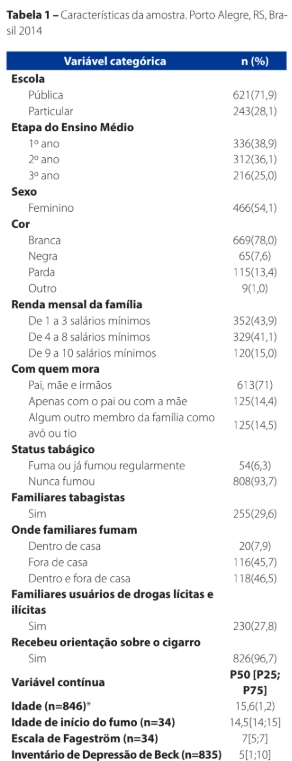
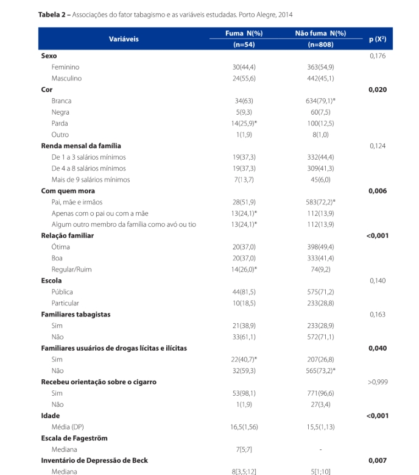

## Introdução

-   Título do artigo
    -   **Fatores associados à iniciação tabágica em adolescentes escolares**
-   Autores
    -   **Carolina de Castilhos Teixeira, Luciano Santos Pinto Guimarães, Isabel Cristina Echer**
-   Publicação: 

## Motivação e Objetivo

-   Motivação da pesquisa
    -   A adolescência é uma fase crítica de formação de identidade, com grande influência de fatores sociais, familiares e culturais.
    -   Mesmo com a ampla divulgação dos malefícios do tabagismo e avanços na área da saúde, muitos jovens continuam iniciando o hábito de fumar.
    -   O processo de parar de fumar é difícil após a dependência, tornando a prevenção da iniciação fundamental. Porém o artigo destaca que existe uma lacuna na literatura sobre os fatores que levam à iniciação tabágica.
-   Objetivo da pesquisa
    -   Identificar os fatores associados à iniciação tabágica em adolescentes escolares.

## Coleta da amostra {.center style="text-align: center;"}

## 

-   Foi realizado um estudo transversal em 2014 onde a população era composta por estudantes do ensino médio de 4 escolas, das quais duas públicas e duas particulares, da Região Sul do Brasil.
-   Convidaram 1000 adolescentes, sendo estes o total de alunos matriculados no ensino médio das quatro escolas, mas apenas 864 participaram efetivamente, compondo a amostra final.

## 

-   Critérios de inclusão:
    -   Ter mais de 12 anos;
    -   Estar matriculado nas escolas selecionadas;
    -   Estar cursando o ano letivo vigente.
-   Critério de exclusão :
    -   Problemas neurológicos que impedissem responder ao questionário.
-   Formas de coleta de dados:
    -   Instrumento autoaplicável, contendo questões sociodemográficas, status tabágico;
    -   Inventário de depressão de Beck;
    -   Escala de Fagerström.

## Metodologia Estatística {.center style="text-align: center;"}

## Variáveis de análise

-   Iniciação tabágica
    -   Se o aluno ja experimentou tabaco
-   Status tabágico
    -   Se ele consume tabaco regularmente

## Fatores de exposição

-   Sociodemográficos
    -   Sexo
    -   Renda
    -   Idade
    -   Cor de pele
    -   Escola
-   Contexto familiar
    -   Com quem mora
    -   Renda familiar
    -   Relação familiar
    -   Familiares tabagistas

## Testes Utilizados

O teste de **Chi-Quadrado(**$\chi^2$) e o teste **Exato de Fisher** foram usados para verificar se há associação entre as variáveis categóricas, com o teste de Fisher sendo usado quando as frequências esperadas eram pequenas e o teste de $\chi^2$ não seria tão preciso.

## Resultados {.center style="text-align: center;"}

## 

## 

## Associações significativas($\chi^2$/Fisher)

-   Indivíduos de cor parda;
-   Associação com maior renda familiar;
-   Morar com apenas um dos pais ou com outros familares;
-   Relações familiares regulares ou ruins;
-   Presença de familiares usuários de drogas.

## Conclusão

-   Dentre todos os fatores relacionados ao tabagismo, os mais fortes eram dentro do contexto familiar.
-   O tabagismo não depende apenas de um único fator, mas de um conjunto de condições sociais, familiares e individuais.

### Importância do teste de Associação

Foram identificadas relações reais nos dados, dando base científica às conclusões, ou seja, transformam dados em evidência científica confiável.

### Contribuição da pesquisa

Fornecer base para estratégias preventivas em saúde pública, especialmente voltadas ao ambiente familiar e escolar
